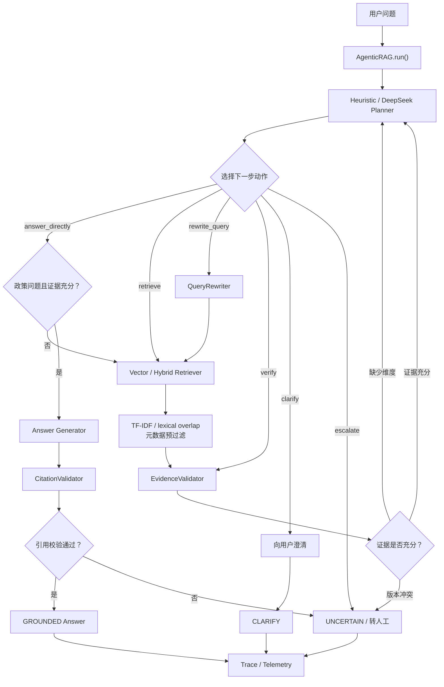
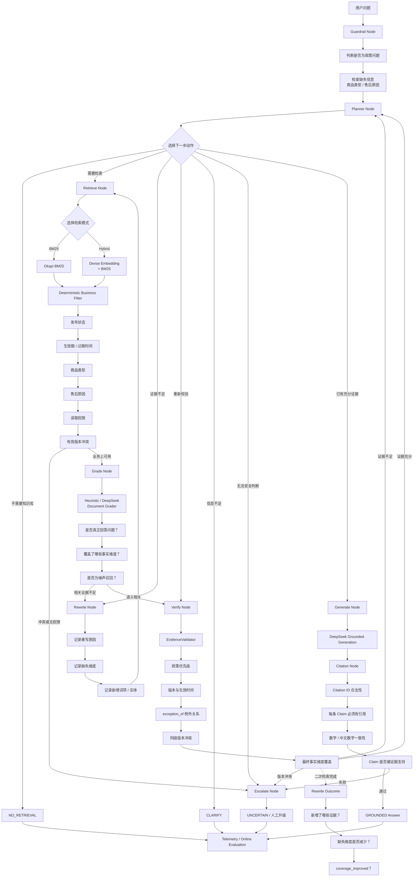
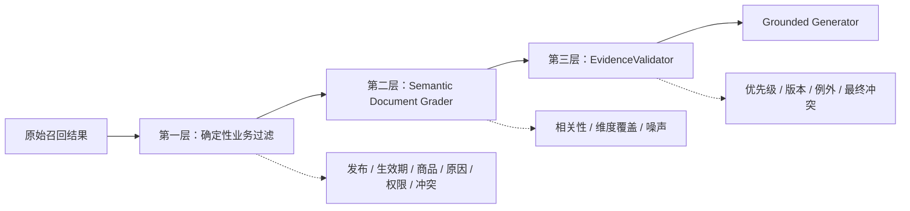
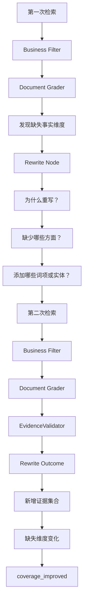
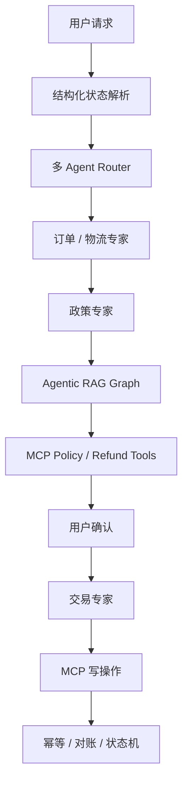

# 阶段六升级最终版：生产级 Agentic RAG

> 最后更新：2026-09-28  
> 项目场景：电商售后智能客服 Agent  
> 当前状态：阶段六当前最终架构，已完成离线回归、生产接口和评测闭环

本文档用于说明阶段六 Agentic RAG 从第一版到升级最终版的架构变化、设计动机、代码映射、运行方法和评测口径。

这里的“最终版”指当前阶段六的最终架构，不代表整个客服 Agent 项目今后不再迭代。当前实现已经具备生产级核心契约，但本地 JSON 索引、JSONL telemetry 和离线 heuristic 组件仍属于可验证的 reference implementation。

## 1. 一句话理解升级结果

升级前：

```text
Planner 决定查不查
→ Retriever 找政策
→ EvidenceValidator 同时判断相关性和政策正确性
→ Generator 生成回答
```

升级后：

```text
显式 Graph 决定每一步
→ BM25 / Dense+BM25 找候选
→ 确定性代码判断候选能不能使用
→ LLM Document Grader 判断候选是否回答问题
→ EvidenceValidator 判断最终应该相信哪条政策
→ Grounded Generator 生成
→ Citation Gate 校验
→ 失败则进入 UNCERTAIN 或人工升级
```

核心权限划分：

```text
LLM：理解语义、提出动作、判断语义相关性、生成回答

确定性代码：判断权限、生效期、商品适用范围、政策版本、
例外关系、版本冲突和最终是否允许进入后续业务链路
```

## 2. 升级前的 Agentic RAG 架构



### 2.1 升级前已经具备的能力

第一版已经不是固定的一次性 RAG。Planner 可以动态选择：

```text
answer_directly
retrieve
rewrite_query
verify
clarify
escalate
```

同时具备首次检索、查询重写、第二次检索、政策生效期校验、优先级与例外关系、版本冲突拒答、Grounded Generation 和 Citation 校验。

### 2.2 升级前的主要问题

1. 主循环包含大量 `if/elif`，节点边界需要阅读完整控制器才能理解；
2. `EvidenceValidator` 同时承担语义相关性和政策权威性判断；
3. Sparse Retrieval 使用 TF-IDF，长文档可能因重复词产生假高分；
4. Query Rewrite 只记录发生了重写，没有完整记录重写收益；
5. 发布状态、权限、语义噪声和政策版本没有形成清晰的分层证据流水线。

## 3. 升级最终版 Agentic RAG 架构



## 4. 升级前后核心差异

| 维度 | 升级前 | 升级最终版 |
|---|---|---|
| 流程组织 | 单个主循环中的 `if/elif` | 显式 typed Graph |
| Sparse 检索 | TF-IDF | Okapi BM25 |
| 生产 Hybrid | Dense + TF-IDF | Dense + BM25 |
| 长文档处理 | 重复词可能造成假高分 | BM25 词频饱和和长度归一化 |
| 业务过滤 | 分散在 Retriever/Validator | 独立 `DeterministicBusinessFilter` |
| 语义评分 | 无独立 Document Grader | Heuristic/DeepSeek Document Grader |
| EvidenceValidator | 同时承担相关性和业务权威性 | 专注政策版本、优先级、例外和冲突 |
| 权限检查 | 未形成完整证据链节点 | Grader 前检查 `permission_scopes` |
| 查询重写 | 记录发生过重写 | 记录原因、缺失维度、新增词、新证据和覆盖改善 |
| 冲突处理 | Validator 发现后转人工 | Business Filter 预检 + Validator 最终复核 |
| 生成条件 | 证据充分后生成 | 三层证据判断全部通过后生成 |
| Citation | 生成后的校验组件 | 独立 Graph Node |
| Trace | 记录动作和检索结果 | 每个 Graph Node 都有独立事件 |
| RAG 评测集 | 7 条核心场景 | 60 条静态待领域审核场景 |
| 评测粒度 | 整体指标 | 整体指标 + 12 类分类指标 |
| 重写评测 | 是否发生重写 | `rewrite_rate` + `rewrite_success_rate` |

## 5. 三层证据判断结构



### 5.1 第一层：Deterministic Business Filter

第一层回答：这条政策在业务上有没有资格进入候选集合？

拒绝原因包括：

```text
NOT_PUBLISHED
NOT_YET_EFFECTIVE
EXPIRED
PRODUCT_TYPE_MISMATCH
AFTER_SALES_REASON_MISMATCH
PERMISSION_DENIED
VERSION_MISMATCH
ACTIVE_VERSION_CONFLICT
```

政策可声明权限：

```json
{
  "required_scopes": ["policy:internal"]
}
```

请求通过 `RetrievalQuery.permission_scopes` 传递权限。没有权限的候选不会进入 LLM Grader。

### 5.2 第二层：Semantic Document Grader

第二层回答：这条业务上可用的政策，是否真正回答当前用户问题？

线上实现为 `DeepSeekDocumentGrader`，离线实现为 `HeuristicDocumentGrader`。结构化输出示例：

```json
{
  "citation_id": "policy_custom_quality_exception_v2#chunk-001",
  "relevant": true,
  "score": 0.95,
  "covered_aspects": ["custom", "quality", "return", "thirty_days"],
  "missing_aspects": [],
  "noise": false,
  "reason": "直接回答定制商品质量问题的退换货期限"
}
```

Document Grader 不能决定政策是否发布、生效、具备权限，也不能在版本冲突中自行选择一条，更不能授权退款或退货。

### 5.3 第三层：EvidenceValidator

第三层回答：在所有语义相关、业务可用的政策中，最终哪一条具有权威性？

检查内容：

- `policy_family`；
- `priority`；
- 最新生效日期；
- 最高有效版本；
- `exception_of` 例外关系；
- 同级版本冲突；
- required aspects 最终覆盖。

最终必须满足：

```text
确定性业务过滤通过
AND
Semantic Document Grader 通过
AND
EvidenceValidator 通过
→ 才允许进入 Generate Node
```

## 6. BM25 与生产 Hybrid Retrieval

### 6.1 为什么使用 BM25

BM25 增加了两个重要机制：

```text
词频饱和：一个词出现 20 次，不会比出现 5 次无限增益
文档长度归一化：长文档不会仅因为内容多而天然占优
```

当前参数：

```text
k1 = 1.5
b  = 0.75
```

旧 `VectorRetriever` 名称为了兼容早期代码仍然保留，但内部不再使用 TF-IDF。

### 6.2 检索模式

```text
BM25Retriever：纯 BM25 sparse baseline

HybridRetriever：BM25 + 词项覆盖率，用于离线无外部依赖对照

DenseHybridRetriever：真实 embedding cosine + normalized BM25
```

生产融合公式：

```text
dense_score  = cosine(query_embedding, chunk_embedding)
sparse_score = normalized BM25(query, chunk)
rerank_score = 0.65 × dense_score + 0.35 × sparse_score
```

Hash embedding 只用于离线测试，不代表真实语义效果。

## 7. 显式 Graph 节点职责

实现位置：[`rag/graph.py`](rag/graph.py)

- `GuardrailNode`：判断政策敏感性和缺失信息；
- `PlannerNode`：选择 answer/retrieve/rewrite/verify/clarify/escalate；
- `RetrieveNode`：执行 BM25、离线 Hybrid 或生产 Dense+BM25；
- `DeterministicBusinessFilter`：检查发布、生效期、商品、原因、权限和冲突；
- `GradeNode`：判断语义相关性、维度覆盖和噪声召回；
- `RewriteNode`：记录重写原因、缺失维度和新增词项；
- `VerifyNode`：由 `EvidenceValidator` 权威复核版本、优先级、例外和冲突；
- `GenerateNode`：只使用 accepted evidence 生成回答；
- `CitationNode`：验证 Claim、Citation 和数字一致性；
- `EscalateNode`：证据不足、冲突或模型链路异常时进入 `UNCERTAIN`。

允许的 Graph 转换在 `AgenticRAGGraph.graph_definition` 中显式声明。

## 8. 查询重写审计闭环



`rewrite` trace 记录：

```text
original_query
rewritten_query
planner_reason
rewrite_reason
missing_aspects_before
added_terms
evidence_before
```

`rewrite_outcome` trace 记录：

```text
new_evidence
missing_aspects_after
coverage_improved
```

这样可以区分“发生过重写”和“重写真的带来了新证据或减少缺失维度”。

## 9. 60 条 RAG 评测集

评测集位置：[`evaluation/rag_cases.json`](evaluation/rag_cases.json)

当前包含 60 条静态场景，共 12 个类别，每类 5 条：

1. `standard_product`：普通商品；
2. `custom_product`：定制商品；
3. `quality_issue`：质量问题；
4. `no_reason_return`：无理由退货；
5. `version_switch`：版本切换；
6. `exception_rule`：例外规则；
7. `ambiguous_expression`：模糊表达；
8. `synonym_rewrite`：同义改写；
9. `adversarial`：对抗性问题；
10. `expired_policy`：过期政策；
11. `version_conflict`：版本冲突；
12. `no_retrieval`：不需要政策检索的问题。

当前数据集审核状态：

```json
{
  "review_status": "pending_domain_owner_review"
}
```

它表示场景已经静态编写、带有预期和审核说明，并通过格式与回放校验，但仍需项目作者或售后领域人员最终确认，不能冒充已经完成业务专家签字的生产数据集。

## 10. 当前离线评测结果

运行：

```bash
python3 -m evaluation.rag_compare_cli \
  --output reports/rag_graph_60.json
```

| 指标 | BM25 | 离线 Hybrid | Agentic Graph |
|---|---:|---:|---:|
| 最终有效证据命中率 | 91.67% | 91.67% | 100% |
| 期望状态准确率 | 90.00% | 90.00% | 100% |
| 平均检索次数 | 1.00 | 1.00 | 0.85 |
| 无检索率 | 0% | 0% | 16.67% |
| 预期冲突判断准确率 | 100% | 100% | 100% |
| 预期无检索行为准确率 | 83.33% | 83.33% | 100% |
| 触发重写后的覆盖改善率 | — | — | 100% |

相较 BM25/离线 Hybrid：

- 最终有效证据命中率提升 8.33 个百分点；
- 期望状态准确率提升 10 个百分点；
- 平均检索次数从 1.00 降至 0.85，下降 15%；
- 预期无检索行为准确率由 83.33% 提升至 100%。

以上数字来自 Heuristic Planner、Heuristic Grader、Deterministic Generator 和 60 条待领域审核场景，用于验证结构行为，不能冒充真实 DeepSeek、真实 embedding 或线上用户流量指标。

当前 `rewrite_success_rate=100%` 只代表触发查询重写的样本获得了覆盖改善，不能脱离触发样本数量单独宣传。

## 11. 代码结构映射

```text
rag/
├── agent.py             # 对外稳定 facade：AgenticRAG.run()
├── graph.py             # 显式 Graph、节点和 RAGGraphState
├── bm25.py              # Okapi BM25 scorer
├── retrieval.py         # BM25Retriever / 离线 Hybrid
├── dense_retrieval.py   # 生产 dense embedding + BM25 Hybrid
├── business_filter.py   # 确定性业务过滤
├── grading.py           # Heuristic / DeepSeek Document Grader
├── rewrite.py           # 可审计查询重写
├── evidence.py          # 政策权威性和冲突验证
├── planner.py           # Heuristic / DeepSeek Planner
├── generation.py        # Deterministic / DeepSeek Generator
├── citation.py          # Claim-level Citation Gate
├── ingestion.py         # Chunking 和索引构建
├── index.py             # 索引版本、发布和回滚
├── monitoring.py        # Telemetry 和 Monitor Agent
└── cli.py               # 交互入口

evaluation/
├── rag_cases.json       # 60 条静态待领域审核场景
├── rag_comparison.py    # BM25 / Hybrid / Agentic 对照评测
├── rag_compare_cli.py   # 离线评测命令
├── online_rag.py        # 延迟标签和反馈评测
└── online_rag_cli.py    # JSONL telemetry 评测入口
```

## 12. 运行方式

### 12.1 全量测试

```bash
python3 -m unittest -v
```

当前结果：

```text
93 个 unittest 通过
132 条原有业务场景校验通过
60 条 RAG 场景对照评测可复现
```

### 12.2 阶段六专项测试

```bash
python3 -m unittest -v \
  test_stage_six.py \
  test_stage_six_production.py
```

### 12.3 离线 BM25

```bash
python3 -m rag.cli --mode bm25
```

### 12.4 离线 Agentic Graph

```bash
python3 -m rag.cli \
  --mode agentic \
  --offline \
  --product-type custom \
  --reason quality_issue
```

### 12.5 构建真实 embedding 索引

```bash
export EMBEDDING_API_KEY="你的 embedding 服务 key"
export EMBEDDING_BASE_URL="https://你的-embedding-endpoint/v1"
export EMBEDDING_MODEL="你的中文 embedding 模型"

python3 -m rag.ingest_cli \
  --embedding-mode env \
  --index-root var/rag_indexes \
  --version policy-2026-09-28 \
  --publish
```

### 12.6 启动真实 Agentic RAG

```bash
export DEEPSEEK_API_KEY="你的 DeepSeek key"
export DEEPSEEK_MODEL="deepseek-v4-flash"

python3 -m rag.cli \
  --mode agentic \
  --production \
  --index-root var/rag_indexes \
  --embedding-mode env \
  --grader-mode llm \
  --generator-mode llm \
  --monitor-sink var/rag_monitor.jsonl
```

在线链路注入：

```text
DeepSeekRAGPlanner
DeepSeekDocumentGrader
DeepSeekAnswerGenerator
```

## 13. 和售后业务主链路的关系

Agentic RAG 只负责政策知识环节，不能直接授权业务写操作。



RAG 判断“政策允许申请退货”，不代表退货申请已经创建，也不代表退款已经到账。后续仍需检查用户身份、订单归属、目标商品、实际订单状态、退款金额、用户确认、MCP 权限、幂等键和业务状态机。

## 14. 生产边界

已经实现的核心契约：

- 独立 ingestion；
- 真实 embedding provider 接口；
- BM25 sparse retrieval；
- Dense+BM25 Hybrid；
- immutable index version；
- CURRENT alias 发布和索引回滚；
- 显式 Agent Graph；
- 双层 Document Grader；
- EvidenceValidator 权威复核；
- Grounded LLM generation；
- Claim-level Citation Gate；
- Telemetry、Monitor Agent 和线上评测入口。

仍属于 reference implementation 的部分：

- 本地 JSON 索引；
- 本地 BM25 内存索引；
- JSONL telemetry；
- 离线 Heuristic Planner/Grader；
- 60 条场景尚待领域人员最终审核。

互联网规模部署应接入 OpenSearch/Elasticsearch、向量数据库、对象存储、OpenTelemetry、标注反馈平台、限流、多副本和 Shadow/A-B 流量评测。

## 15. 面试中的一分钟表达

> 第一版 Agentic RAG 是 Planner 驱动的多步循环，能够决定是否检索、查询重写、证据验证和人工升级，但检索相关性与政策权威性主要集中在 EvidenceValidator 中，而且 sparse retrieval 使用 TF-IDF。
>
> 升级后，我将执行链拆成显式 Graph，包括 Guardrail、Retrieve、Business Filter、Document Grader、Rewrite、Verify、Generate、Citation 和 Escalate 节点。检索侧将 TF-IDF 替换成带文档长度归一化的 BM25，生产 Hybrid 使用真实 embedding 加 BM25。
>
> 证据判断采用三层结构：确定性过滤负责发布状态、生效期、商品类型、售后原因、权限和冲突；LLM Grader 只负责语义相关性和维度覆盖；EvidenceValidator 最终负责版本、优先级、例外关系和政策权威性。这样即使 LLM 判断错误，也不能绕过政策规则。
>
> 查询重写会记录缺失维度、补充词、新增证据和覆盖改善。我将评测集从 7 条扩展到 60 条静态场景，在当前离线结构评测中，Agentic Graph 的有效证据命中率为 100%，BM25 baseline 为 91.67%；期望状态准确率从 90% 提升到 100%，平均检索次数从 1 次下降到 0.85 次。

## 16. 最终架构原则

1. Planner 可以选择动作，但不能制造政策事实；
2. LLM Grader 可以判断语义相关性，但不能决定政策权威性；
3. Query Rewrite 可以扩展检索词，但不能把扩展词当成用户事实；
4. EvidenceValidator 负责版本、优先级、例外和冲突的最终判断；
5. Generator 只能使用 accepted evidence；
6. 每条事实 Claim 必须带合法 citation；
7. 政策冲突不能猜测，必须进入 `UNCERTAIN` 或人工升级；
8. RAG 不能绕过订单、金额、确认、MCP 权限和状态机；
9. 离线 heuristic 指标不能冒充真实线上模型指标；
10. 所有关键失败都必须能通过 trace、测试和评测复现。

最终总结：

```text
让 LLM 负责它擅长的语义理解和生成，
让确定性代码负责不能出错的业务事实和安全边界。
```
